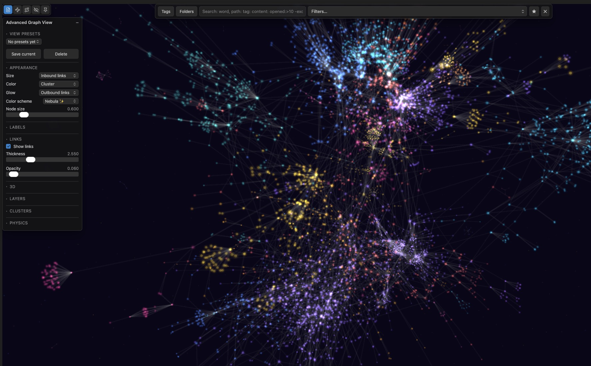

# Advanced Graph View


*[▶ Full-quality video](https://github.com/n23eos/advanced_graph_view/blob/main/assets/advanced_graph_view_opt.mp4)*



An advanced replacement for Obsidian's Graph View, built for large vaults (5,000–50,000 notes) where the default graph turns into a hairball. The graph becomes an analysis tool instead of a decoration: it shows what you actually use, where your knowledge hubs are, and how your vault grew over time.

## Features

- **Metric-driven node encoding** — assign any metric to size, color, or glow: PageRank, open frequency (all-time / 90 / 30 / 7 days), edit recency, note age, in/out links, file size, folder, tag, or cluster. Default: size = PageRank, color = edit recency.
- **WebGL rendering** (Pixi.js v8) — 10,000+ nodes at 50+ FPS. Force layout runs in a Web Worker; the UI thread never computes physics.
- **Usage tracking** — fully local log of note opens (counted after 5s of active viewing). Day-level buckets compact into months and years. Export to CSV or wipe at any time.
- **Clusters** — Louvain community detection with automatic TF-IDF naming, cluster bubbles, per-cluster zoom and hide.
- **Overlays** — orphans (no inbound links), dead ends (no outbound), broken links, each with live counters.
- **Search & filters** — native graph syntax (`path:`, `tag:`, `file:`, `-exclude`) plus new operators: `opened:>10`, `opened:30d>5`, `edited:<30d`, `created:>2024-01-01`, `links:>5`, `inlinks:0`, `unresolved:>0`, `cluster:"name"`. Live highlight while typing, Enter to hard-filter, saved presets.
- **Focus mode** — double-click a node to see only its N-hop neighborhood (depth 1–4) with distance-based fading. Esc to exit.
- **Color schemes** — categorical palettes for folders/tags/clusters and gradient scales for metrics, plus glowing "galaxy" schemes with additive blending.
- **Timeline** — watch your vault grow month by month with a play button and an activity sparkline.
- **Session trail** — animated arrows retrace your navigation path through the vault, with replay.
- **Insights dashboard** — totals, top notes by opens and PageRank, cooling hubs (important but stale), 90-day activity.
- **Export** — current view as PNG, graph data as JSON or GEXF (Gephi).

## Permissions and behavior

The plugin review surfaces the capabilities a plugin uses. Here is what this one does and why:

| Capability | Why it is needed |
|---|---|
| Vault enumeration | The graph *is* the list of notes and links — every node comes from `getMarkdownFiles()` and `metadataCache`. Nothing leaves your machine. |
| Vault read | Note bodies are read only for `content:` search, via `cachedRead`. |
| Clipboard | Write-only, and only from the lasso menu item "Copy list of paths". The clipboard is never read. |
| Dynamic code execution | Comes only from the Web Workers (layout and metrics), which are instantiated from inlined source. No user content is ever evaluated as code. |

## Privacy & network

- **No telemetry. No analytics. Everything stays on your machine.**
- The plugin makes **no network requests** at all.

## Data

Plugin data lives in `.obsidian/plugins/graph-insight/data/`:

| File | Contents |
|------|----------|
| `usage.json` | aggregated open counts |
| `positions.json` | saved node positions |

Settings → Advanced Graph View has buttons to export usage as CSV, clear statistics, or reset all plugin data.

## Mobile

The graph view works on mobile (WebGL via Pixi).

## Development

```bash
npm install
npm run dev     # watch build
npm run build   # typecheck + production build
npm test        # vitest suite
npm run lint
```

Architecture notes: force layout (`d3-force`) and PageRank/Louvain (`graphology`) each run in their own Web Worker, inlined into `main.js` as Blob workers. Edges render as a single GPU line-list mesh — position updates write into a vertex buffer instead of rebuilding geometry.

## License

MIT
