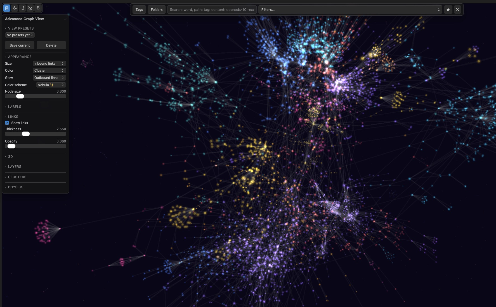
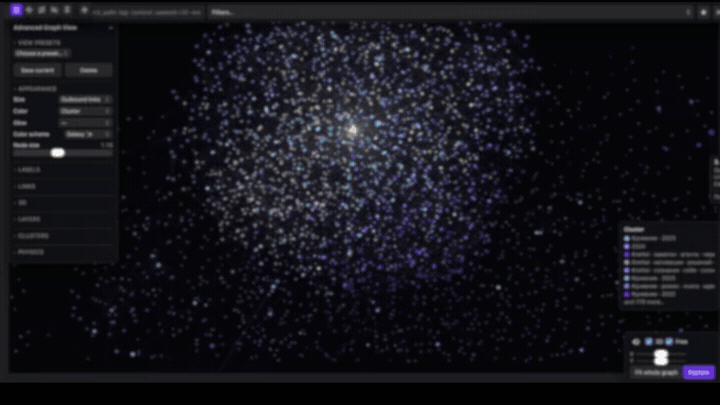

> **⭐ Found this useful? [Star the repo](https://github.com/n23eos/advanced_graph_view)** — that's how other people find it.


# Advanced Graph View


*[▶ Full-quality video](https://github.com/n23eos/advanced_graph_view/blob/main/assets/advanced_graph_view_opt.mp4)*



An advanced replacement for Obsidian's Graph View, built for large vaults (5,000–50,000 notes) where the default graph turns into a hairball. The graph becomes an analysis tool instead of a decoration: it shows what you actually use, where your knowledge hubs are, and how your vault grew over time.

> **Desktop only.** The renderer leans on WebGL and two Web Workers; the plugin declares `isDesktopOnly: true` and will not load on Obsidian mobile.

## Installation

Not yet in the Community Plugins directory. Two ways to install:

### BRAT (recommended — gets updates automatically)

1. Install the **BRAT** plugin from Community Plugins and enable it.
2. Command palette → **BRAT: Add a beta plugin for testing**.
3. Paste `n23eos/advanced_graph_view` and confirm.
4. Settings → Community Plugins → enable **Advanced Graph View**.

### Manual

1. Download `main.js`, `manifest.json` and `styles.css` from the [latest release](https://github.com/n23eos/advanced_graph_view/releases/latest).
2. Create `<your vault>/.obsidian/plugins/graph-insight/` and drop the three files in.
3. Reload Obsidian, then enable **Advanced Graph View** in Settings → Community Plugins.

> The folder must be named `graph-insight` — that is the plugin id, kept stable so existing installs keep their usage history.

Open the graph with the ribbon icon (git-fork) or the command **Advanced Graph View: Open graph view**.

Requires Obsidian **1.13.0** or newer.

## Features

- **Metric-driven node encoding** — assign any metric to size, color, or glow: PageRank, open frequency (all-time / 90 / 30 / 7 days), edit recency, note age, in/out links, file size, folder, tag, or cluster. Default: size = PageRank, color = edit recency.
- **WebGL rendering** (Pixi.js v8) — 10,000+ nodes at 50+ FPS. Force layout runs in a Web Worker; the UI thread never computes physics.
- **Usage tracking** — fully local log of note opens (counted after 5s of active viewing). Day-level buckets compact into months and years. Export to CSV or wipe at any time.
- **Clusters** — Louvain community detection with automatic TF-IDF naming, cluster bubbles, per-cluster zoom and hide.
- **Overlays** — orphans (no inbound links), dead ends (no outbound), broken links, each with live counters.
- **Search & filters** — native graph syntax (`path:`, `tag:`, `file:`, `-exclude`) plus new operators: `opened:>10`, `opened:30d>5`, `edited:<30d`, `created:>2024-01-01`, `links:>5`, `inlinks:0`, `unresolved:>0`, `cluster:"name"`. Live highlight while typing, Enter to hard-filter, saved presets.
- **Focus mode** — double-click a node to see only its N-hop neighborhood (depth 1–4) with distance-based fading. Esc to exit.
- **Explore mode** — travel the graph one link at a time, No Man's Sky style: point the mouse down a link, click, and the camera flies to the note at the other end. [See below](#explore-mode).
- **Local graph pane** — a sidebar view of the neighborhood around whatever note you have open, in 3D or flat. A depth slider (1–4 hops) sets how far it reaches, rings are colored and faded by distance from the root, and the camera frames the cloud on its own. Open it from the toolbar or the command palette; the depth and 3D toggle are remembered.
- **Local graph export** — write the neighborhood out as a Markdown note beside the root: one section per depth ring, direction arrows on the first ring (→ outgoing, ← incoming, ↔ mutual), and each deeper note names the note it was reached through. Clickable wikilinks, so the map lives inside your vault.
- **Camera that frames itself** — in 2D the view fits the whole graph after the layout settles and after switching a preset; panning or zooming by hand cancels it, so your framing always wins. Nodes never shrink below 2.5 px on screen, and the layout spread scales with vault size so large vaults don't fly apart and small ones don't clump.
- **Side pane** — a toolbar toggle: a click opens the note in a pane beside the graph rather than over it, and the next note you click replaces it in that same pane. The graph never leaves the screen.
- **Follow active note** — a toolbar toggle: open a note anywhere in the vault and the camera moves to it and marks it. It stands aside while explore mode is flying the camera, and when the note is filtered out it leaves your filter alone rather than clearing it. In focus mode it rebuilds the neighborhood around the new note instead of panning.
- **Pins** — hold a note in place against the physics. Pinned notes are ringed, survive graph rebuilds and restarts, and a lasso selection can be pinned or released in one go.
- **Commands for everything** — every layer, the timeline, cluster bubbles, physics, 3D, explore and focus mode have command-palette entries, so you can bind whichever ones you use to your own hotkeys.
- **Color schemes** — categorical palettes for folders/tags/clusters and gradient scales for metrics, plus glowing "galaxy" schemes with additive blending. On a light theme the brightest scheme colors are dimmed so nodes stay visible, and switching theme repaints the graph immediately.
- **View presets** — bundled recipes you switch between in one click, including four diagnostic ones: **Orphans**, **Broken links** and **Dead ends** light only what matches and name it, and **Attention map** sizes by PageRank against color by opens in the last 90 days, so a big cold node is a hub you have stopped reading. Save your own alongside them.
- **Timeline** — watch your vault grow month by month with a play button and an activity sparkline.
- **Session trail** — animated arrows retrace your navigation path through the vault, with replay.
- **Insights dashboard** — totals, top notes by opens and PageRank, cooling hubs (important but stale), 90-day activity.
- **Export** — current view as PNG, graph data as JSON or GEXF (Gephi), and your settings as a profile you can import into another vault.

### Explore mode



*[▶ Full-quality video](https://github.com/n23eos/advanced_graph_view/blob/main/assets/advanced_graph_view_explore.mp4)*

The camera sits on one note. Its links fan out, the notes at their far ends are the only ones lit and named, and the rest of the vault falls back to a dim backdrop. Sweep the mouse toward a link and it brightens, gains an arrow, and the note it leads to is named at the cursor — click to fly there, and that note becomes the new center.

Aiming is by **direction**, not by pixel: you point *at* a link rather than hitting the line, so a hub with fifty overlapping links stays navigable. Nothing moves on hover alone — every trip is a deliberate click.

`Backspace` retraces the trail, `Space` lets go of the current note so you can pick the next one anywhere in the vault, `Esc` leaves. **Open** puts the current note in a new tab without interrupting the trip. Hops keep the scale you set with the wheel and move only what the camera looks at. Physics pauses and 3D switches on for the duration — at runtime only, your saved settings are never written to.

## Permissions and behavior

The plugin review surfaces the capabilities a plugin uses. Here is what this one does and why:

| Capability | Why it is needed |
|---|---|
| Vault enumeration | The graph *is* the list of notes and links — every node comes from `getMarkdownFiles()` and `metadataCache`. Nothing leaves your machine. |
| Vault read | Note bodies are read only for `content:` search, via `cachedRead`. |
| Clipboard | Write-only, and only from the lasso menu item "Copy list of paths". The clipboard is never read. |
| Dynamic code execution | Comes only from the Web Workers (layout and metrics), which are instantiated from inlined source. No user content is ever evaluated as code. |

## Privacy & network

- **No telemetry. No analytics. Everything stays on your machine.**
- The plugin makes **no network requests** at all.

## Data

Plugin data lives in `.obsidian/plugins/graph-insight/data/`:

| File | Contents |
|------|----------|
| `usage.json` | aggregated open counts |
| `positions.json` | saved node positions and pinned notes |

Settings → Advanced Graph View has buttons to export usage as CSV, clear statistics, or reset all plugin data.

## Languages

The interface follows Obsidian's own app language. Twelve locales ship with the plugin:

English, Deutsch, Español, Français, Italiano, 日本語, 한국어, Polski, Português (Brasil), Русский, Українська, 简体中文.

Anything else falls back to English, as does a regional variant with no file of its own (`fr-CA` → `fr`). Changing the app language takes effect after the plugin reloads.

Translations live in `src/i18n/locales/`, one file per language, all typed against `en.ts` — a locale missing a key fails the build, so no release can ship a half-translated file. Only English is native; the rest are machine-translated and corrections are welcome.

## Mobile

Not supported. The plugin is marked `isDesktopOnly: true`: the layout and metrics Web Workers plus a 10k-node WebGL scene are past what mobile Obsidian handles comfortably, and shipping a version that loads but crawls is worse than not loading at all.

## Development

```bash
npm install
npm run dev        # watch build
npm run build      # typecheck + production build
npm test           # vitest suite
npm run typecheck
npm run lint
npm run verify     # lint + typecheck + tests, same gate as CI
```

CI (`.github/workflows/ci.yml`) runs lint, typecheck, tests and a production build on every push and pull request. Tagged pushes additionally run `.github/workflows/release.yml`, which builds, attests provenance and publishes the release assets.

Architecture notes: force layout (`d3-force`) and PageRank/Louvain (`graphology`) each run in their own Web Worker, inlined into `main.js` as Blob workers. Edges render as a single GPU line-list mesh — position updates write into a vertex buffer instead of rebuilding geometry.

## Feedback

The plugin is in beta and bug reports are the fastest way to make it better.

[**Report a bug or request a feature**](https://docs.google.com/forms/d/e/1FAIpQLSeUwcQWrqM5XxDYih633cLqJOyeObSgeJ6p8CIp1SleQ34-Ew/viewform)

The form asks for your plugin/Obsidian version, OS, vault size and the steps you took, so an issue can usually be reproduced without any follow-up questions. No sign-in required; email is optional.

## License

MIT

## Support

If this project was useful to you, feel free to support further development:

[](https://etherscan.io/address/0x77777da54702AC8789D53fc7cC6201C29a1A88C4)
[](https://etherscan.io/address/0x77777da54702AC8789D53fc7cC6201C29a1A88C4)
